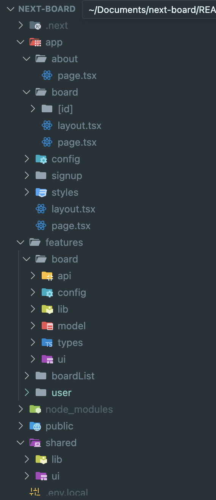
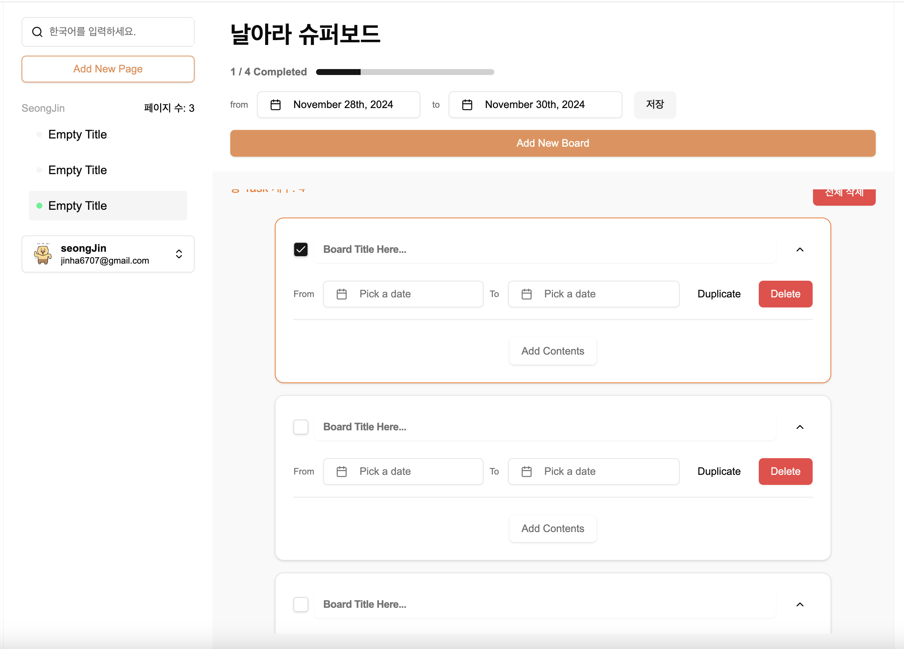

### 프로젝트 에디터 정리

### 프로젝트 목적

Next.js 학습과 서버와 클라이언트 간의 상태 관리, supabase를 이용한 간단한 백엔드 구현으로 여러가지 기능 붙여봄으로써, FSD 구조와 친해지기 위해 진행한 프로젝트입니다.

### 폴더구조

그동안 아토믹 디자인 패턴을 사용해봐서 이번엔 supabase로 DB도 연동하고 백엔드도 살짝 건드려서 프로젝트를 진행하다보니, FSD라는 아키텍쳐에 관심이 가 사용해보기로 했다. 프로젝트를 완성되었을때의 전반적인 폴더 구조는 다음과 같다.



기존 FSD 아키텍처에서는 라우터 관련 부분을 pages폴더로 분리하는걸 권장하지만, 저는 Next.js의 app router를 사용하다보니 라우터 관련 기능들도 app에서 관리하도록 해주었습니다.

config 폴더에는 전역설정과 관련한 파일들이 들어가게 되는데, supabase를 연동하기 위한 코드들이 담기도록 했습니다.

features 폴더는 크게 `슬라이스`라는 개념으로 비즈니스 도메인별로 board, boardList, user 기능이 존재하기 때문에 3개로 나누었습니다. 프로젝트 완성본을 보시면, 다음과 같습니다!



왼쪽 BoardAside Component, 상단에는 BoardListHeader Component 그리고 Board들을 담고 있는 형태로 구성되어있습니다.

`슬라이스`로 관리되어지는 features/board 컴포넌트 내에는 또 다시 FSD 구조에서 `세그먼트` 개념으로 기존에는 ui, api, model, lib, config 로 구분하여 사용하는게 보편적이지만, 해당 부분은 어느정도 규약을 지키면서 자신의 입맞게 수정하는게 좋다고 생각이 들어 저는 types 폴더를 하나 더 두어 관리했습니다. 뿐만아니라, user 폴더 내에는 store라는 폴더를 두어서 jotai 라이브러리로 유저의 정보를 관리하도록 했습니다.

#### features/user/store/atoms.ts

```javascript
import { atomWithStorage } from "jotai/utils";
import { UserType } from "../types";

export const initUserAtom: UserType = {
    id: "",
    email: "",
    phoneNumber: "",
    nickname: "",
    imgUrl: "",
};

export const userAtom = (atomWithStorage < UserType) | (null > ("user", null));
```

모든 도메인에서 사용되어지는 공통 로직은 `shared` 폴더에서 관리하였으며 그 아래에는 공통으로 사용될법한 비즈니스 로직은 lib 폴더에, ui는 말그대로 공통 컴포넌트를 배치하였습니다.

공통으로 사용되어지는 ui에는 모두 Radix 기반 라이브러리인 `schdcn ui`로 대부분 작성하였으며, 커스텀이 필요한 부분은 css와 인터페이스를 살짝 바꾸고 제공하였습니다.

```javascript
"use client";

import {
    AlertDialog,
    AlertDialogContent,
    AlertDialogDescription,
    AlertDialogFooter,
    AlertDialogHeader,
    AlertDialogTitle,
    AlertDialogTrigger,
} from "@/shared/ui";

interface Props {
    triggerElement: React.ReactNode;
    title: string;
    description?: string;
    children: React.ReactNode;
}
function CommonAlertDialog({
    triggerElement,
    title,
    description,
    children,
}: Props) {
    return (
        <AlertDialog>
            <AlertDialogTrigger asChild>{triggerElement}</AlertDialogTrigger>
            <AlertDialogContent>
                <AlertDialogHeader>
                    <AlertDialogTitle>{title}</AlertDialogTitle>
                    <AlertDialogDescription>
                        {description}
                    </AlertDialogDescription>
                </AlertDialogHeader>
                <AlertDialogFooter>{children}</AlertDialogFooter>
            </AlertDialogContent>
        </AlertDialog>
    );
}

export { CommonAlertDialog };
```

기존 AlertDialog를 커스텀하여 dialog를 띄우도록 하는 triggerElement를 받고, 모달 하부에 보여줄 부분에 대해선 사용자에게 제공함으로써 children으로 받도록 했습니다.

---

### middleware.ts

쿠키를 활용하여 클라이언트에 돔이 그려지기전에 이 middleware.ts 파일에서 중간 처리를 해주는데, 유저에 대한 처리를 진행하였다.  
물론 클라이언트단에서 useEffect로도 처리할 수 있는 기능이지만, 유저 인증에 대한 로직은 해당 middleware에서 처리하는게 깔끔하다 느꼈다. (클라이언트에서 처리하면 사이드이펙트가 발생할 여지가 있어...)

```javascript
"use server";

import { NextResponse } from "next/server";
import type { NextRequest } from "next/server";
// 서버쪽에서 document 접근 불가능.
// import { getCookieByKey } from "./shared/lib/cookie";

export function middleware(req: NextRequest) {
    const user = req.cookies.get("user");

    const url = req.nextUrl;

    if (!user) {
        // 유저가 없는데... "/board"로 접근 시 "/"로 리다이렉트
        if (url.pathname.startsWith("/board")) {
            return NextResponse.redirect(new URL("/", req.url));
        }
    } else {
        // 유저가 쿠키에 있고, "/" 또는 "/signup"에 접근시엔 board로
        if (url.pathname === "/" || url.pathname === "/signup") {
            return NextResponse.redirect(new URL("/board", req.url));
        }
    }

    return NextResponse.next();
}

// 인증이 필요한 경로 지정
export const config = {
    matcher: ["/", "/signup", "/board/:path*"],
};
```

미들웨어에서 무언갈 처리하는게 낯설어 꽤나 헤맨 부분이다. 인증과 필요한 경로를 지정하고, 유저가 없을때와 있을대 처리를 쿠키에 있는 유저정보로 하여금 url.pathname 함수로 처리하였다.

### 마무리

재사용되어지는 부분은 적절하게 나누고 모든 부분을 전부 hooks나 파일로 분리하는게 좋은것만은 아니다라고 생각하여 한 번만 사용되어지는 함수는 해당 함수를 사용하는 컴포넌트 내에서 처리하도록 하였다.  
supabase도 이번에 처음 사용해보면서 뒷단에서 커스텀할게 많이 없다면? 간단하게 백엔드를 구축하면 다른 프로젝트에도 큰 무기가 될 거라고 생각했다.
로그인도 구현해보면서, 여러가지 상황에 대해 처리하는 좋은 경험을 가지게 되었다.
로그인 직후에 뒤로가기를 막다던가, 비로그인시 board페이지 불가, 사용자가 내가 작성한 게시글에 접근했을때 에러처리하기 등 많은걸 다시 생각해보게 되었다.
